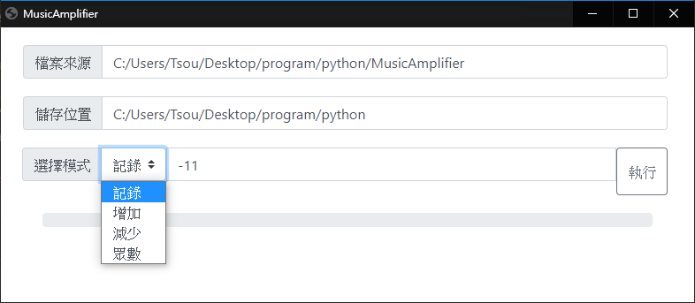

想修改音樂檔案的分貝大小，但我知道的網頁一次只能處理一筆且有時候和其他音樂檔案的大小差距還是無法一致，這樣要一直挑整聲量很麻煩，所以使用[pybub](https://github.com/jiaaro/pydub)套件來處理音樂檔案的部份，安裝與API介紹請到作者的github。

另外順便使用最近看到的python視窗化套件[eel](https://github.com/samuelhwilliams/Eel)，`eel`是Electron的框架，簡單的說跟開發網頁差不多，但結果呈現是桌面應用程式這樣，可以用網頁前端語言來開發，會方便很多，雖然我的版面就算套了bootstrap還是很陽春，ㄏㄏ。

在後端操作上只要了解`eel`的寫法我覺得比pyqt還要方便，不用一直設定signal，雖然還是要設定按鈕和function啦，但我覺得以網頁的方式在程式碼上比較不會參雜在一起，不然就是我之前功力還不夠，寫起來很亂。

所以結合以上的套件自己寫了一支桌面應用程式來玩，可以批次修改音檔的分貝大小，執行程式後會讀取資料夾路徑與上次輸入的分貝大小，支援的音樂格式有`wav`, `mp3`, `flac`，模式有分成四種：

1. 記錄：將所有音檔設定成上次執行記錄的值，會有這模式是因為想說可以記錄下來上次音檔的眾數值。

2. 增加：將所有的音檔增加N分貝。
3. 減少：將所有的音減少加N分貝。
4. 眾數：取得所有音檔的分貝眾數後，將所有音檔設定成這個值。

`眾數`的值會是負數，我也不知道為什麼讀取出來的分貝值會是負的，啊我就懶，所以就不想要修正這邊了。

另外，我沒有做防呆，所以記得檔案來源跟儲存位置要輸入哦，分貝值除了`眾數值模式`之外也都要輸入，有其他bug的話再麻煩告訴我，不然我會懶得修改...

